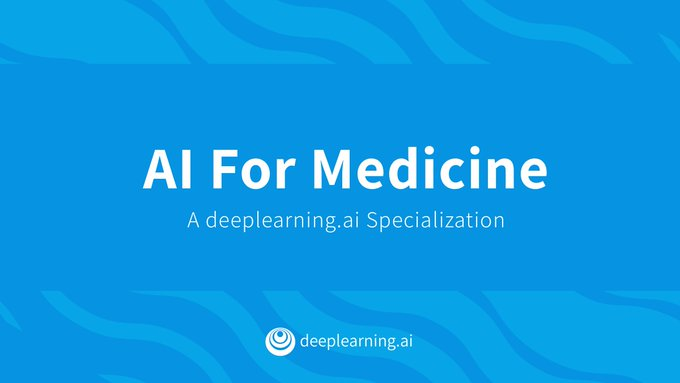
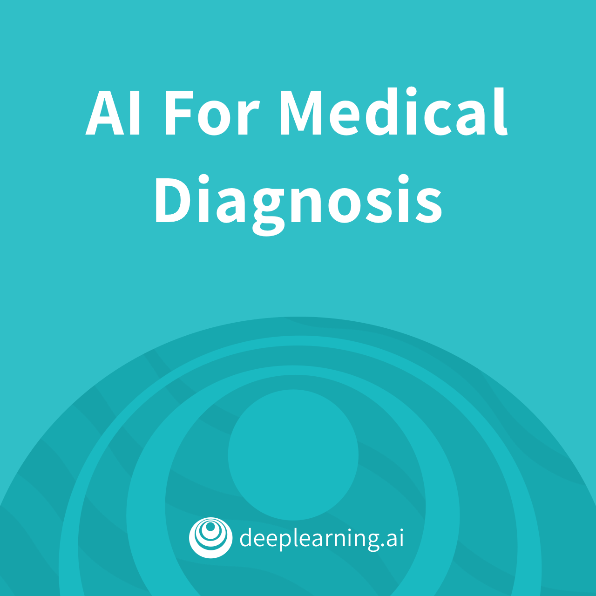

# AI For Medicine Specialization

   

Grupo de Estudios enfocado en los cursos de especialización [AI For Medicine](https://www.coursera.org/specializations/ai-for-medicine) ofrecido por coursera.

## ¿Cuál es la dinámica del grupo de estudio?

Nos reunimos semanalmente abarcando temas específicos, revisando el material disponible en el curso con anticipación. El día de la reunión, uno de los integrantes hará una presentación del tema correspondiente y se resolverán las dudas que hayan al respecto. Los demás integrantes pueden aportar con temas adicionales, entablar discusión y voluntariarse para la presentación en futuras reuniones. Algunas semanas serán basadas en presentaciones teóricas y otras en prácticas, dependiendo de las tareas o ejercicios del curso.

## Curso 1

   

¿Cómo se puede aplicar Inteligencia Artificial en imágenes médicas para diagnosticar enfermedades? En este primer curso, aprenderemos sobre a  trabajar con datos de imágenes médicas en 2D y 3D, para la clasificación de varias clases y la segmentación de imágenes. Luego aplicaremos lo aprendido para clasificar enfermedades en imágenes de rayos X y segmentar tumores en imágenes cerebrales de resonancia magnética en 3D. Finalmente, aprenderemos a evaluar adecuadamente el rendimiento de nuestros modelos.

### Week 1: Disease detection with computer vision

Tema  | Notebook |
------|:-:|
Data Exploration & Image Pre-Processing | 
Counting labels and weighted loss function | 
Densenet | 
Patient Overlap - practice |

____
Únete a nuestra comunidad: https://www.facebook.com/MLDLMeetupAQP/
